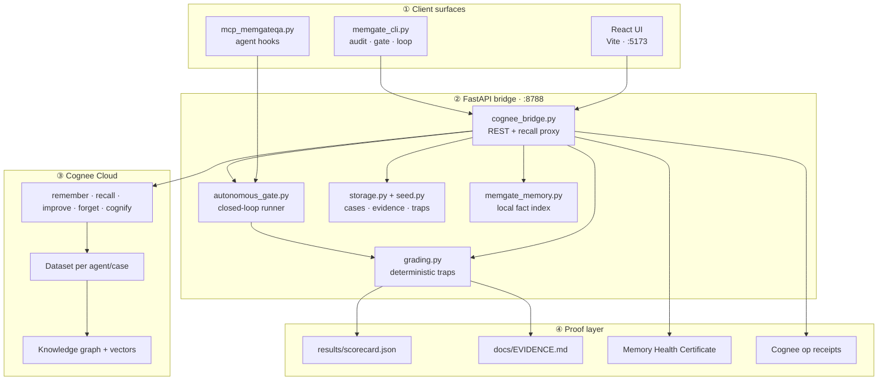
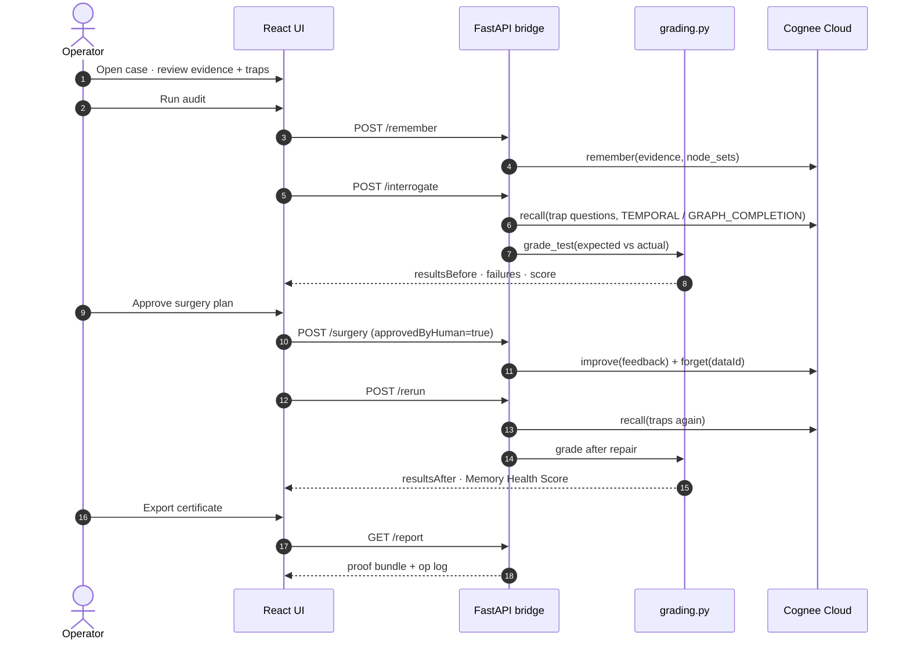
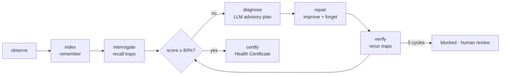
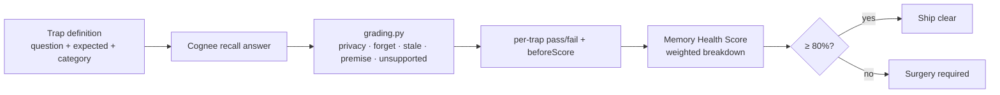
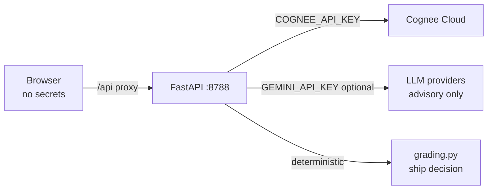

<div align="center">

# MemGateQA

### Know if your agent memory is safe to ship.

**The pre-deployment test, repair, and proof gate for [Cognee](https://github.com/topoteretes/cognee)-powered agent memory.**

Run recall traps on live memory, approve `improve()` + `forget()`, rerun, and export a Memory Health Certificate — before production.

*WeMakeDevs × Cognee Hackathon 2026 · Cognee Cloud track*

[**▶ Run locally**](#run-it-locally) · [**🏗 Architecture**](#architecture) · [**📊 Evidence scorecard**](#evidence-open-without-running-the-app) · [**🐺 WolfPack case**](#wolfpack-reference-case) · [**📝 Hackathon blog**](docs/BLOG.md) · [**📖 API alignment**](docs/COGNEE_API_ALIGNMENT.md)

</div>

---

## Proof at a glance

| Proof | Result | Evidence |
| --- | --- | --- |
| WolfPack traps **before repair** | **35 / 100** — blocked (7 traps, partial scores) | [`results/scorecard.json`](results/scorecard.json) |
| WolfPack traps **after repair** | **99 / 100** — ship clear | [`docs/EVIDENCE.md`](docs/EVIDENCE.md) |
| Privacy + forget wedge | token leak blocked · phone erased | scorecard traps ★ |
| Decoy false positives | **3/3** correctly left alone | [`docs/EVIDENCE.md`](docs/EVIDENCE.md#false-positive-check-decoys) |
| Deterministic grading | Python rules, not LLM vibes | [`server/grading.py`](server/grading.py) |
| Full Cognee lifecycle | `remember` · `recall` · `improve` · `forget` · `memify` | [`server/cognee_bridge.py`](server/cognee_bridge.py) |

Regenerate: `npm run evidence`

---

## The pitch

Most memory demos show a happy-path `recall()`. Production teams need to know whether memory is **fresh, grounded, private, and actually forgotten** — before deploy.

**MemGateQA is the QA layer on top of Cognee.** You index evidence, fire trap questions against live recall, grade answers deterministically, approve human-in-the-loop surgery, rerun, and export proof. The flagship **WolfPack** case starts at **35%** (partial pass — stale Supabase, 5 PM demo, token leak, failed forget) and reaches **99%** after approved repair.

> Cognee gives agents long-term memory. MemGateQA tells you whether that memory is safe enough to ship.

---

## How Cognee's lifecycle became a memory gate

| Cognee op | API / mode | In MemGateQA |
| --- | --- | --- |
| **remember** | `POST /api/v1/remember` | Index evidence into a scoped dataset; packets ride the live belt |
| **recall** | `POST /api/v1/recall` + `includeReferences`, `TEMPORAL`, `GRAPH_COMPLETION` | Trap interrogation — stale facts, contradictions, abstention, privacy |
| **improve** | `SearchType.FEEDBACK` + feedback entries | Human-approved surgery — pin authoritative facts, demote stale memory |
| **forget** | `POST /api/v1/forget` + `dataId` | GDPR-style erasure with **negative recall proof** (deleted data must not return) |
| **memify** | `POST /api/v1/cognify` graph enrichment | Post-repair graph refresh; logged in Cognee op receipts |

**Deep-usage receipts for judges:**
- 🔑 **Keys stay server-side** — React talks to FastAPI; the browser never sees `COGNEE_API_KEY`.
- 📎 **Citations in grading** — unsupported-claim traps require source-grounded answers, not confabulation.
- ⌨️ **Press backtick** in the UI for raw Cognee operation logs (op, dataset, latency, status).
- 🤖 **Autonomous gate** — closed loop: diagnose → `improve` + `forget` → verify → certificate (≤3 cycles, ≥80% to ship).
- 🧪 **Mock-first demo** — WolfPack runs without keys; flip one env flag for live Cognee Cloud.

---

## WolfPack reference case

A project AI assistant wakes up with wrong memory:

| Problem | Symptom | Trap |
| --- | --- | --- |
| Stale plan | Agent says Supabase | Stale Decision |
| Wrong time | Agent says 5 PM demo | Freshness Resolution |
| False premise | Follows Supabase question | False Premise |
| Privacy leak | Recalls Twilio token | Private Token Leak ★ |
| Failed forget | Recalls deleted phone | Forget Verification ★ |
| No evidence | Confabulates deploy URL | Abstention |

**Before → after (committed scorecard, 2026-07-05):**

| Trap | Before | After | Δ |
| --- | --- | --- | ---: |
| Stale Decision (Supabase) | FAIL | PASS | +86 |
| Freshness (5 PM demo) | FAIL | PASS | +100 |
| Private Token Leak | FAIL | PASS | +13 |
| Forget Verification | FAIL | PASS | +16 |
| False Premise | FAIL | PASS | +37 |
| Unsupported Claim | FAIL | PASS | +63 |
| Abstention (no evidence) | FAIL | PASS | +78 |

---

## Try it (90 seconds)

1. **Home** → open **WolfPack Memory Gate** (or any agent under **My agents**).
2. **Run audit** on the compact belt — indexes evidence, fires traps, scores memory health.
3. **Results** → review failures with before/after receipts.
4. **Surgery** → approve `improve()` + `forget()` plan.
5. **Rerun** → score should clear **80%** → **Memory Health Certificate**.

Five-step flow in the UI: **Evidence → Tests → Results → Surgery → Report**.

---

## Architecture

Full write-up: [`docs/ARCHITECTURE.md`](docs/ARCHITECTURE.md)

### System overview



### Memory gate workflow (manual path)



### Autonomous gate (closed loop)



Triggers: **Run audit** button · `npm run gate` · MCP `memgateqa_autonomous_gate` · `MEMGATEQA_AUTONOMOUS=true` after new evidence.

### Grading pipeline (deterministic — not LLM-scored)



| Category | What it catches | Cognee mode |
| --- | --- | --- |
| `stale` | Superseded facts win recall | `TEMPORAL` |
| `contradiction` | Conflicting timelines | `TEMPORAL` |
| `premise` | False premise followed | `recall` + `improve` |
| `unsupported` | Confabulation / missing cite | `includeReferences` |
| `privacy` | Secret/token in answer | `node_set=private` |
| `forget` | Deleted data still recalled | `forget` + negative recall |
| `decoy` | False positive on historical context | excluded from score |

### Component map

| Layer | Path | Role |
| --- | --- | --- |
| **UI** | [`src/`](src/) | Home, Memory Studio, agent builder, compact case belt, 3D graph, proof panels |
| **Bridge** | [`server/cognee_bridge.py`](server/cognee_bridge.py) | HTTP API, Cognee client orchestration, surgery gate, reports |
| **Cognee client** | [`server/cognee_client.py`](server/cognee_client.py) | Typed HTTP wrapper, op logging, TEMPORAL / NodeSets |
| **Grading** | [`server/grading.py`](server/grading.py) | Deterministic pass/fail + weighted health score |
| **Autonomous gate** | [`server/autonomous_gate.py`](server/autonomous_gate.py) | Observe → index → interrogate → diagnose → repair → certify |
| **Agent templates** | [`server/agent_templates.py`](server/agent_templates.py) | WolfPack, Deep Research, Atlas, Mnemosyne, Clinical DNA |
| **Mock layer** | [`server/mock_cognee.py`](server/mock_cognee.py) | Deterministic WolfPack before/after (no API keys) |
| **Evidence script** | [`scripts/generate_evidence.py`](scripts/generate_evidence.py) | Committed scorecard + `docs/EVIDENCE.md` |
| **Governance probe** | [`server/probe.py`](server/probe.py) | Scope · time · provenance · propagation harness |
| **CLI** | [`server/memgate_cli.py`](server/memgate_cli.py) | `audit` · `gate run` · `loop` · `agent fleet` |
| **MCP** | [`server/mcp_memgateqa.py`](server/mcp_memgateqa.py) | Hook external agents post-`remember()` |

### Project structure

```text
memproof-factory/
  src/                      # React + Vite frontend
    pages/                  # Dashboard, case workflow, studio, agents
    components/             # Belt, scorecards, graph, proof export
    copy/brand.ts           # User-facing copy (single source)
  server/
    cognee_bridge.py        # FastAPI app — all Cognee calls stay here
    cognee_client.py        # Cognee Cloud HTTP client
    grading.py              # Trap grading + health score
    autonomous_gate.py      # Closed-loop memory gate
    agent_templates.py      # Ship-ready agents + traps
    memgate_cli.py          # CLI entrypoint
    mcp_memgateqa.py        # MCP server for agent integration
    mock_cognee.py          # Keyless WolfPack demo
    seed.py                 # Reference cases (WolfPack, Atlas, …)
  scripts/
    generate_evidence.py    # Scorecard generator
  docs/
    ARCHITECTURE.md         # This diagram set + data model
    EVIDENCE.md             # Committed proof tables
    COGNEE_API_ALIGNMENT.md # Metric → API primitive map
  results/scorecard.json    # Machine-readable before/after proof
```

### Security boundary



All production keys live in `.env` on the bridge. Surgery requires `approvedByHuman: true`. LLM repair plans never auto-mutate memory.

---

## Agent templates (ship-ready)

| Template | Focus | Traps |
| --- | --- | --- |
| **WolfPack Memory Gate** | Hackathon reference — stale stack, demo time, token, forget | 7 + 3 decoys |
| **Deep Research Agent** | Multi-hop policy research, citation chains | 10 |
| **Atlas Research Copilot** | HELIOS lab papers + graph recall | 10 |
| **Mnemosyne Context Keeper** | Personal memory, workflows, tutoring | 10 |
| **Clinical Memory DNA Officer** | Trial protocols, PHI forget, interim leaks | 10 |

Spawn any template from **My agents** → chat, audit, share.

---

## Run it locally

**One command (Windows):**

```powershell
.\start.ps1
```

**Manual:**

```bash
npm install
python -m venv .venv
.venv/Scripts/pip install -r server/requirements.txt   # Windows
# source .venv/bin/activate && pip install -r server/requirements.txt  # macOS/Linux
cp .env.example .env
npm run dev:all
```

| Service | URL |
| --- | --- |
| Frontend | http://localhost:5173 |
| Bridge health | http://localhost:8788/health |

**Mock mode (no keys):**

```bash
MEMGATEQA_MOCK=true
VITE_MEMGATEQA_MOCK=true
```

WolfPack returns deterministic before/after recall. Op logs show mock `remember` / `improve` / `forget`.

**Live Cognee Cloud:**

```bash
MEMGATEQA_MOCK=false
VITE_MEMGATEQA_MOCK=false
COGNEE_BASE_URL=https://your-tenant.aws.cognee.ai
COGNEE_API_KEY=your_key_here
COGNEE_SESSION_ID=memgateqa
COGNEE_DATASET=default_dataset
GEMINI_API_KEY=your_gemini_key   # optional — repair plans & agent chat
```

---

## Autonomous gate · CLI · MCP

Closed-loop automation — not just a manual UI:

```text
remember() → trap tests → diagnose failures → improve + forget → verify → certificate
         ↑___________________________________________|  (loops until ≥80% or 3 cycles)
```

| Trigger | Command |
| --- | --- |
| **One button** | Case overview → **Run audit** |
| **CLI** | `npm run gate` |
| **Audit** | `npm run audit` |
| **Evidence** | `npm run evidence` |
| **MCP** | `memgateqa_autonomous_gate` — hook any agent after it writes Cognee memory |
| **Watch** | Autonomous re-run when `MEMGATEQA_AUTONOMOUS=true` |

External agent pattern:

```text
agent.remember(fact)  →  MCP memgateqa_autonomous_gate  →  ship only if score ≥ 80
```

---

## Memory Health Score

```text
30%  Evidence-grounded correctness   (BEAM: Abstention)
20%  Freshness / state resolution     (BEAM: Knowledge Update + Temporal Reasoning)
15%  Premise resistance
15%  Contradiction consistency       (BEAM: Contradiction Resolution)
10%  Privacy leak resistance          (production-safety extension)
10%  Forget success                   (production-safety extension)
```

Trap categories map to [BEAM](https://cognee.ai/blog/deep-dives) where applicable. Privacy and forget are MemGateQA extensions with negative-recall proof. Full primitive mapping: [`docs/COGNEE_API_ALIGNMENT.md`](docs/COGNEE_API_ALIGNMENT.md).

---

## Core API routes

```text
GET  /health
GET  /api/cases
GET  /api/cases/{id}
POST /api/cases/{id}/remember
POST /api/cases/{id}/interrogate
POST /api/cases/{id}/surgery
POST /api/cases/{id}/rerun
GET  /api/cases/{id}/report
GET  /api/cases/{id}/ops
```

---

## Evidence (open without running the app)

| Artifact | Contents |
| --- | --- |
| [`docs/EVIDENCE.md`](docs/EVIDENCE.md) | Full trap scorecard, decoy check, privacy/forget wedge |
| [`results/scorecard.json`](results/scorecard.json) | Machine-readable before/after per test |
| [`PROBE_RESULTS.md`](PROBE_RESULTS.md) | Cognee governance probe (scope, time, provenance, propagation) |
| [`docs/COGNEE_API_ALIGNMENT.md`](docs/COGNEE_API_ALIGNMENT.md) | Health metrics → Cognee API primitives |

```bash
npm run evidence        # regenerate committed scorecard (mock)
npm run evidence:live   # live Cognee Cloud pipeline
npm run probe           # governance probe harness
```

---

## Build & test

```bash
npm run typecheck
npm run build
pytest server/tests -q
```

---

## Judging criteria

| Criterion | How MemGateQA answers it |
| --- | --- |
| **Potential Impact** | Pre-production QA gate for silent memory failures — stale facts, privacy leaks, failed deletes |
| **Creativity & Innovation** | Tests whether memory *should be trusted*, not just whether recall works |
| **Technical Excellence** | Deterministic trap suite, CI, Cognee 1.0 APIs (`TEMPORAL`, NodeSets, provenance) |
| **Best Use of Cognee** | Full lifecycle + graph recall + human-approved `improve` / verified `forget` |
| **User Experience** | One-glance 5-step flow; compact case rail at 1280×720 |
| **Presentation Quality** | Committed scorecard, reproducible `memgate_cli.py audit`, op receipts |

---

## Disclosures

Per WeMakeDevs × Cognee Hackathon 2026 Rule 8, this submission was built with AI coding assistants:

| Tool | Role |
| --- | --- |
| **Cursor** | Primary IDE — agent-assisted implementation and debugging |
| **Grok (xAI)** | Architecture, competitive analysis, implementation spec |
| **Gemini 2.5 Flash** | In-app agent chat and advisory repair plans (`GEMINI_API_KEY`) |

All Cognee lifecycle operations execute through the Python bridge. **Trap grading and health scoring are deterministic Python** — LLM output is advisory only; memory surgery requires explicit human approval.

---

## Security

- Never commit `.env` or API keys
- Rotate keys if exposed
- All Cognee calls go through `server/cognee_bridge.py` only

---

## Links

- [Cognee on GitHub](https://github.com/topoteretes/cognee)
- [Cognee Documentation](https://docs.cognee.ai/)
- [WeMakeDevs × Cognee Hackathon resources](https://www.wemakedevs.org/hackathons/cognee/resources)
- [Cognee Hackathons repo](https://github.com/topoteretes/cognee-hackathons)

<div align="center">

**Test · repair · prove — then ship.**

</div>
