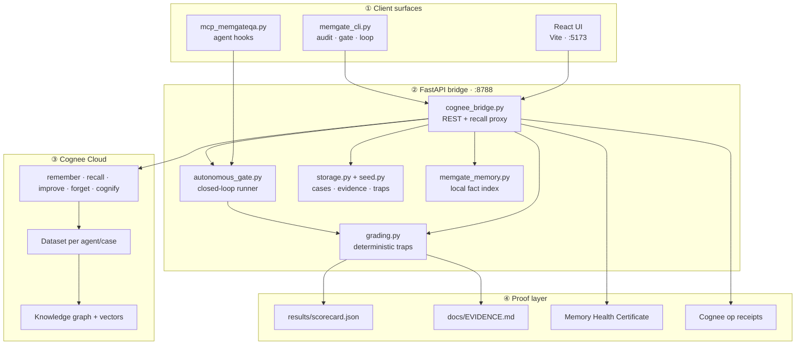
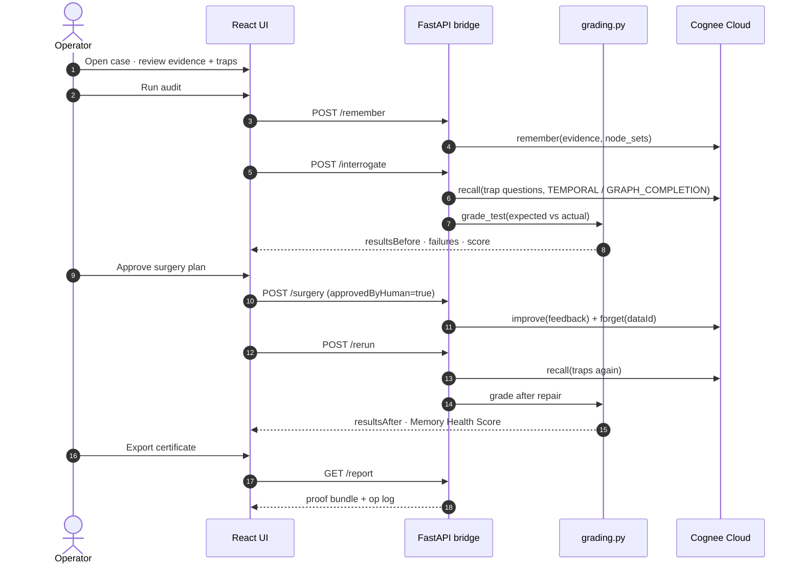
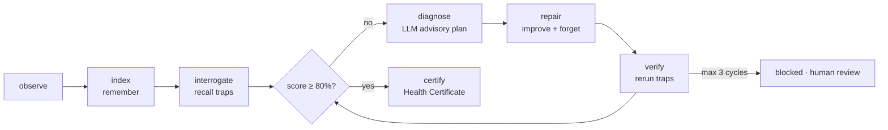
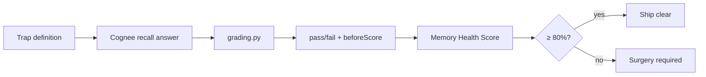
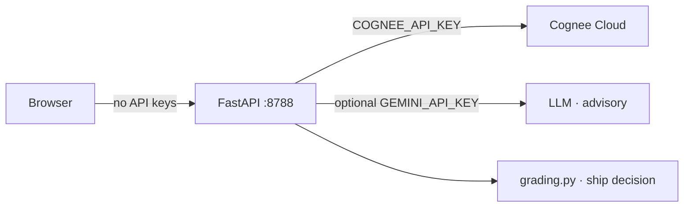

# Architecture — MemGateQA

MemGateQA is a **pre-deployment memory gate** for Cognee-powered agents: index evidence, interrogate recall with traps, grade deterministically, approve surgery, rerun, and export proof.

---

## System overview



---

## Memory gate workflow



UI stations map 1:1 to API phases:

| UI step | Bridge route | Cognee ops |
| --- | --- | --- |
| Evidence | `POST /remember` | `remember()` |
| Tests | `POST /interrogate` | `recall()` per trap |
| Results | (read case) | graded `resultsBefore` |
| Surgery | `POST /surgery` | `improve()` + `forget()` |
| Report | `GET /report` | certificate + scorecard |

---

## Autonomous gate



Implementation: [`server/autonomous_gate.py`](../server/autonomous_gate.py)

- Debounced auto-trigger after `remember()` when `MEMGATEQA_AUTONOMOUS=true`
- LLM (`agent_loop.gap_fill_plan`) proposes repair text — **never auto-applies** without surgery approval path
- Ledger: [`server/loop_store.py`](../server/loop_store.py)

---

## Grading pipeline



Grading is **deterministic Python** in [`server/grading.py`](../server/grading.py). LLM output is advisory for repair plans and agent chat only.

| Category | Grading signal |
| --- | --- |
| `privacy` | Secret patterns absent + refusal language |
| `forget` | No leaked PII/phone + short refusal |
| `stale` / `contradiction` | Fresh keywords vs stale hits (Supabase, 5 PM) |
| `premise` | Corrects false premise, does not follow it |
| `unsupported` | Citations present, no invented URLs |
| `decoy` | On-topic, not flagged as defect |

Weights → health score: see [`docs/COGNEE_API_ALIGNMENT.md`](COGNEE_API_ALIGNMENT.md).

---

## Components

### React frontend (`src/`)

- **Dashboard** — home, agent preview, quick links
- **Case workflow** — compact belt, tabs: Overview → Evidence → Tests → Results → Surgery → Report
- **Memory Studio** — 3D graph, witness wall, trap runner, RAG vs graph compare
- **Agent platform** — chat builder, template spawn, share links
- **Proof panels** — `ProofScorecard`, before/after split, op log (backtick)

Keys never enter the bundle. Dev proxy forwards `/api` and `/health` to `:8788`.

### FastAPI bridge (`server/cognee_bridge.py`)

- Case CRUD, remember / interrogate / surgery / rerun
- Cognee HTTP via [`cognee_client.py`](../server/cognee_client.py)
- Mock fallback via [`mock_cognee.py`](../server/mock_cognee.py) when `MEMGATEQA_MOCK=true`
- Proof bundle zip, graph endpoints, autonomous gate hooks
- Human gate: `approvedByHuman: true` on surgery

### Case store (`server/storage.py`, `server/seed.py`)

Each **case** contains:

```text
id, name, agent, dataset, templateId
evidence[]     — facts to remember (with sensitivity, shouldForget)
tests[]        — trap questions (category, expected, weight)
resultsBefore[], resultsAfter[]
reports[], cogneeDataIds{}, lastScore, lastBreakdown
```

Reference cases: WolfPack, Atlas, Mnemosyne, Clinical DNA (seeded on startup).

### Integration surfaces

| Surface | Entry | Use case |
| --- | --- | --- |
| UI | `npm run dev:all` | Interactive audit + certificate |
| CLI | `memgate_cli.py audit` | Reproducible WolfPack proof |
| CLI | `memgate_cli.py gate run` | Autonomous closed loop |
| MCP | `mcp_memgateqa.py` | Post-`remember()` gate in agent toolchain |
| Script | `generate_evidence.py` | Committed `scorecard.json` + `EVIDENCE.md` |
| Probe | `probe.py` | Cognee governance dimensions (scope, time, …) |

---

## Security boundary



Rules:

- Browser never receives `COGNEE_API_KEY` or `GEMINI_API_KEY`
- Private evidence uses Cognee `node_set=private` + scoped recall
- `forget()` requires explicit surgery approval
- Public share links redact secrets by default ([`server/agent_publish.py`](../server/agent_publish.py))

---

## Mock vs live

| Mode | Env | Behavior |
| --- | --- | --- |
| **Mock** | `MEMGATEQA_MOCK=true` | [`mock_cognee.py`](../server/mock_cognee.py) returns deterministic WolfPack before/after |
| **Live** | `MEMGATEQA_MOCK=false` + `COGNEE_API_KEY` | Real Cognee Cloud dataset per case |

Committed proof (`npm run evidence`) uses mock for reproducible 0→100 scorecard without keys. Live pipeline: `npm run evidence:live -- --fresh`.

---

## Production hardening (roadmap)

- Map every evidence item to exact Cognee `dataId` for forget audits
- Tenant isolation + RBAC on surgery routes
- CI policy: block deploy when score &lt; 80 or critical trap fails
- Postgres-backed case store + immutable run receipts
- PDF certificate export

---

## Links

- [Cognee API alignment](COGNEE_API_ALIGNMENT.md)
- [Evidence scorecard](EVIDENCE.md)
- [Bring your own case](BRING_YOUR_OWN_CASE.md)
- [Cognee on GitHub](https://github.com/topoteretes/cognee)