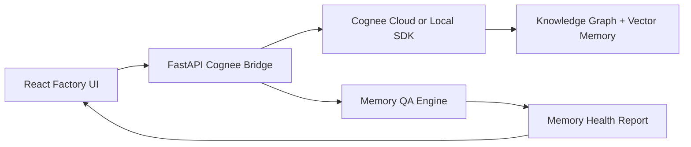
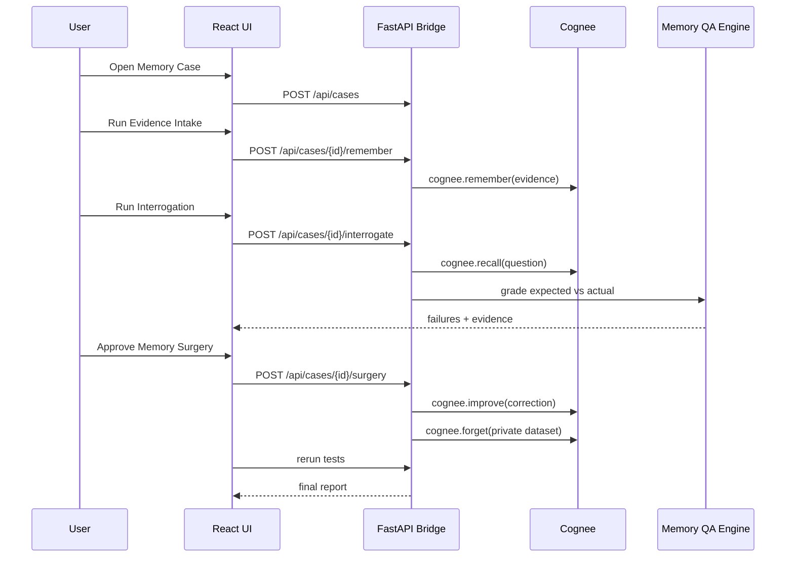

# Architecture — MemGateQA

## System overview



## Components

### 1. React frontend

Responsibilities:

- show Memory Case lobby
- animate Evidence Factory flow
- show Interrogation Room
- show Suspect Wall
- show Memory Surgery approvals
- show Case Closed Report

Important files:

```text
src/App.tsx
src/memgateqa/demoData.ts
src/memgateqa/scoring.ts
src/memgateqa/cogneeClient.ts
src/memgateqa/types.ts
```

### 2. FastAPI bridge

File:

```text
server/cognee_bridge.py
```

Responsibilities:

- keep `COGNEE_API_KEY` off the browser
- connect to Cognee Cloud/local SDK
- expose stable HTTP endpoints
- support mock mode for reliable hackathon demo
- enforce human approval before memory surgery

### 3. Cognee memory layer

Cognee handles:

- memory ingestion
- knowledge graph construction
- recall
- memory improvement
- forget/delete operations

Cognee's public README describes it as an open-source AI memory platform that gives agents persistent long-term memory across sessions through ingestion, graph memory, vector embeddings, graph reasoning, and ontology generation.

Source: https://github.com/topoteretes/cognee

### 4. Memory QA Engine

Currently deterministic in frontend demo data. Production version should move grading to backend.

Responsibilities:

- compare expected answer vs Cognee answer
- check source evidence
- classify failures
- compute Memory Health Score
- recommend `remember`, `improve`, `forget`, or `human-review`

## Data flow



## Production hardening

For a real deployment:

- map evidence IDs to actual Cognee document/dataset IDs
- isolate private memory into separate datasets
- add auth and tenant-level case isolation
- log all memory surgery approvals
- store reports in Postgres
- add export to PDF/JSON
- move grading from frontend mock data to backend evaluator
- run tests in CI before agent deployment

## Security rule

The browser must never receive:

- `COGNEE_API_KEY`
- LLM provider keys
- private raw evidence that has been marked secret unless user has permission

All real Cognee calls go through the FastAPI bridge.
