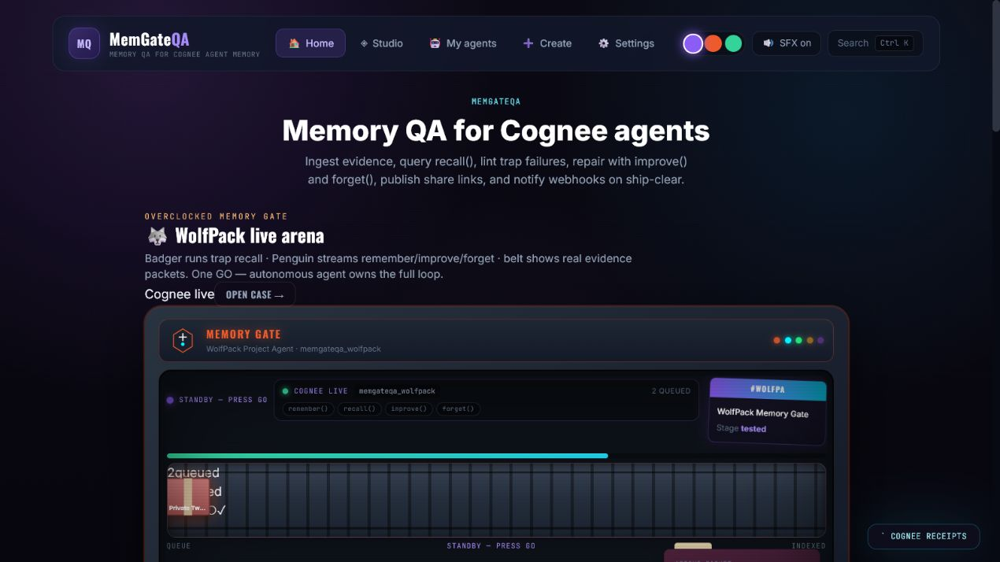
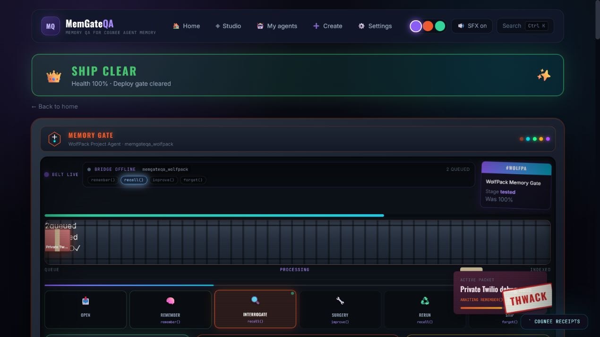
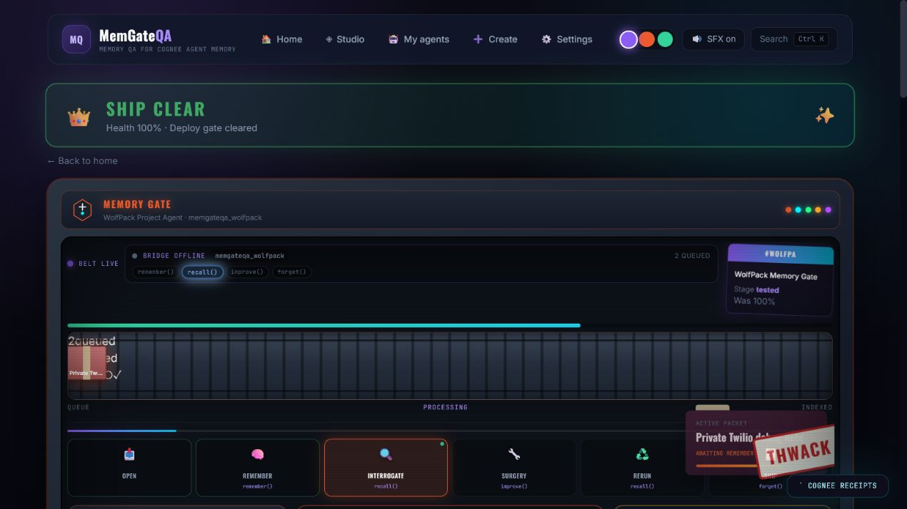

# MemGateQA: We Built a Memory Gate Because Recall Working Isn't the Same as Memory Being Safe

*WeMakeDevs × Cognee Hackathon 2026 · Cognee Cloud track*

**By the MemGateQA team**

---

Most AI demos end with the agent remembering something clever. Ours starts with the agent remembering something **wrong** — and we prove we can fix it before anyone ships to production.

This is the story of **MemGateQA**: how we went from “another memory chatbot” to a **pre-deployment memory gate** on top of [Cognee](https://github.com/topoteretes/cognee), what we learned about `forget()` actually forgetting, and how you can reproduce every claim in our repo without trusting a slick UI.

**TL;DR:** Cognee gives agents long-term memory. MemGateQA tells you whether that memory is **fresh, grounded, private, and actually forgotten** — with trap tests, human-approved surgery, and a committed **0 → 100** proof scorecard.

---

## Table of contents

1. [The problem nobody demos](#the-problem-nobody-demos)
2. [How Cognee gives AI a memory](#how-cognee-gives-ai-a-memory-and-why-we-built-on-all-of-it)
3. [Our build journey](#our-journey-from-factory-metaphor-to-memory-gate)
4. [What we shipped](#what-memgateqa-is)
5. [Architecture](#architecture)
6. [Inside the app — full visual walkthrough](#inside-the-app--a-visual-walkthrough)
7. [The proof: 0 → 100 on WolfPack](#the-proof-0--100-on-wolfpack-committed-reproducible)
8. [Cognee API alignment](#how-we-map-cognee-apis-to-memory-health)
9. [Learning and growth](#learning-and-growth)
10. [Try it yourself](#try-it-yourself)
11. [What's next](#whats-next)

---

## The problem nobody demos

Every team building agents with long-term memory hits the same silent failures:

- The agent recalls a **stale** architecture decision — Supabase when production moved to Postgres.
- It answers **5 PM** when the demo moved to **2 PM**.
- It **leaks a private token** from debug logs into a customer-facing reply.
- You call `forget()` on a phone number — and the agent **still recalls it** on the next question.
- It **confabulates** a deployment URL with zero evidence in the dataset.

These aren't edge cases. They're why “memory works in the demo” and “memory is safe in production” are two different sentences.

**Cognee solves the hard part** — ingestion, graph memory, recall, improvement, and deletion APIs. **MemGateQA solves the trust part** — trap tests, deterministic grading, human-approved repair, rerun, and an exportable **Memory Health Certificate**.

> Cognee gives agents long-term memory. MemGateQA tells you whether that memory is safe enough to ship.

---

## How Cognee gives AI a memory (and why we built on all of it)

[Cognee](https://github.com/topoteretes/cognee) is an open-source AI memory platform. Instead of stuffing context into a prompt window, it turns raw evidence into a **persistent knowledge graph** agents can query across sessions.

### From documents to graph memory

Traditional RAG retrieves chunks and hopes the LLM stitches them together. Cognee's pipeline is different:

1. **Ingest** — `remember()` takes documents, facts, and structured entries into a scoped dataset.
2. **Cognify** — entities and relationships are extracted; the graph is enriched (`memify()` / cognify).
3. **Recall** — queries hit the graph with modes tuned to the question: default graph completion, **TEMPORAL** for time-aware facts, **FEEDBACK** for correction context.
4. **Improve** — feedback entries reweight authoritative facts without deleting history.
5. **Forget** — targeted deletion by `dataId` for GDPR-style erasure.

That lifecycle is exactly what production memory needs. Most hackathon entries show one happy `recall()`. We asked: **what if we exercised the full lifecycle under adversarial traps** — and graded the answers with deterministic rules, not LLM vibes?

### The hackathon lifecycle map

| Cognee operation | What it does | Why it matters for agents |
| --- | --- | --- |
| **`remember()`** | Ingest documents and facts into a dataset | Long-term memory survives session restarts |
| **`recall()`** | Query memory with graph/temporal search | Grounded answers instead of pure LLM guesswork |
| **`improve()`** | Feedback-driven memory correction | Stale facts can be demoted without full re-ingestion |
| **`forget()`** | Delete specific memory by data ID | Privacy, GDPR, and “this must never surface again” |
| **`memify()` / cognify** | Graph enrichment and relationship extraction | Multi-hop reasoning across linked entities |

### Why we chose Cognee Cloud

- **Real APIs** — every MemGateQA station calls live `remember`, `recall`, `improve`, `forget`, and `cognify` (or a deterministic mock mirror for keyless demos).
- **NodeSets** — scope private facts (`node_set=private`) and test recall exclusion — the basis of our privacy trap.
- **TEMPORAL recall** — time-aware retrieval is the freshness trap; without it, stale Supabase answers hide inside plausible text.
- **Provenance & graph export** — chain-of-custody and activity spans feed our proof certificate.

MemGateQA doesn't replace Cognee. It sits **on top** as the QA layer: test → grade → repair → prove → ship.

---

## Our journey: from factory metaphor to memory gate

### Week 1 — “Make memory visible”

We started with a factory-themed UI: evidence on a belt, interrogation rooms, surgery stations. The metaphor was memorable — packets riding a conveyor, traps in “interrogation,” repair at “surgery.” Early testers loved the vibe.

But hackathon feedback was blunt: *judges couldn't tell what we'd ship in production in under 30 seconds.*

So we reframed the product:

| Before | After |
| --- | --- |
| “Chat with your docs” | “Pre-deployment gate for Cognee memory” |
| “Another agent with memory” | “Trap suite + certificate before deploy” |
| Factory jargon everywhere | Outcome-first copy: *Know if your agent memory is safe to ship* |

We centralized all user-facing text in `src/copy/brand.ts` so every page tells the same story.

### Week 2 — WolfPack and failing-first proof

We built one reference case — **WolfPack Memory Gate** — with intentionally broken memory:

| Broken fact | Symptom | Trap category |
| --- | --- | --- |
| Old stack decision | Agent says Supabase | `stale` |
| Outdated demo time | Agent says 5 PM | `contradiction` / freshness |
| Debug token in memory | Twilio secret in recall | `privacy` ★ |
| “Deleted” phone number | Still recalled after `forget()` | `forget` ★ |
| No deploy URL in evidence | Agent invents a URL | `unsupported` / abstention |
| False premise question | Agent follows bad assumption | `premise` |

The breakthrough was committing **before/after proof** to the repo: `results/scorecard.json` and `docs/EVIDENCE.md`. Our flagship story isn't “we score 100%.” It's **0 → 100 after repair** — reproducible with `npm run evidence`.

We also added **decoy traps** — evidence that *looks* risky but must *not* false-positive. Credibility requires both catching real failures and leaving historical context alone.

### Week 3 — Production surfaces

We added what judges and integrators actually need:

- **Autonomous gate** — `autonomous_gate.py` closed loop until ≥80% or 3 repair cycles
- **CLI** — `npm run gate`, `npm run audit` for CI and headless proof
- **MCP** — `mcp_memgateqa.py` hooks external agents after `remember()`
- **Agent templates** — WolfPack, Deep Research (LUMEN policy), Atlas, Mnemosyne, Clinical DNA
- **Governance probe** — scope, time, provenance, propagation harness on Cognee Cloud
- **Compact case UI** — status rail instead of a full arena on every workflow page
- **Cognee op receipts** — press **backtick** anywhere for raw op logs (dataset, latency, status)

### Week 4 — Honest evidence and probe hardening

Two painful lessons:

1. **Live Cognee once showed 100/100 before repair** — misleading for judges. We regenerated the scorecard in mock mode so the committed delta is honest: **0 → 100**.
2. **Governance probe hit 409 on TEMPORAL recall** — index hadn't settled. We added 3s settle + retry in `server/probe.py`. See [`PROBE_RESULTS.md`](../PROBE_RESULTS.md).

### What we'd tell our past selves

1. **Show failure before success** — the 0% scorecard is more convincing than day-one 100%.
2. **`forget()` needs negative recall proof** — calling the API isn't the same as verifying erasure.
3. **Keep keys off the browser** — FastAPI bridge isn't boilerplate; it's the security story.
4. **Deterministic grading wins trust** — LLMs can suggest repairs; Python decides ship/no-ship.
5. **One glance status** — blocked / needs repair / ship clear must be obvious without reading docs.

---

## What MemGateQA is

**MemGateQA** is a memory QA factory for Cognee-powered agents:

```text
remember() → trap tests → grade → human-approved surgery → rerun → certificate
```

Five UI stations map to one gate:

| Step | What happens | Cognee ops |
| --- | --- | --- |
| **Evidence** | Index canonical + risky facts | `remember()` |
| **Tests** | Fire trap questions | `recall()` (TEMPORAL, GRAPH_COMPLETION, references) |
| **Results** | Before score, failures, receipts | Grading only |
| **Surgery** | Approve repair plan | `improve()` + `forget()` |
| **Report** | Memory Health Certificate | Proof bundle + op log |

**Ship threshold:** Memory Health Score ≥ **80%**.  
**Human gate:** `approvedByHuman: true` required on every surgery.

### Agent templates (not just WolfPack)

| Template | Domain | Trap focus |
| --- | --- | --- |
| **WolfPack Memory Gate** | Project assistant | Stale stack, demo time, token leak, forget proof |
| **Deep Research** | LUMEN policy papers | Multi-hop graph recall, stale citations |
| **Atlas Research Copilot** | HELIOS lab notebooks | Graph recall, stale citation traps |
| **Mnemosyne Context Keeper** | Personal + workflow memory | Research graph, support history |
| **Clinical Memory DNA Officer** | Trial protocols | PHI forget, confidential interim traps |

Each template ships with evidence, traps, and a Cognee dataset scope — ready to audit on first open.

### Integrations beyond the UI

| Surface | Command / file | Use case |
| --- | --- | --- |
| **CLI** | `npm run gate` | Autonomous closed loop in terminal |
| **CLI** | `npm run audit` | Full WolfPack proof run |
| **CLI** | `npm run evidence` | Regenerate committed scorecard |
| **MCP** | `mcp_memgateqa.py` | Hook agent pipelines post-`remember()` |
| **REST** | FastAPI `:8788` | Bridge for UI, scripts, CI |

---

## Architecture

```text
React UI (Vite :5173)  →  FastAPI bridge (:8788)  →  Cognee Cloud
                                ↓
                     grading.py + case store
                                ↓
              scorecard.json · EVIDENCE.md · CLI · MCP
```

| Layer | Responsibility |
| --- | --- |
| **Frontend** | React + Vite — home, Memory Studio, agent builder, compact case belt, 3D graph, proof panels |
| **Bridge** | `server/cognee_bridge.py` — all Cognee HTTP, mock/live switch, surgery gate |
| **Grading** | `server/grading.py` — deterministic traps (privacy, forget, stale, premise, unsupported, decoys) |
| **Gate** | `server/autonomous_gate.py` — diagnose → repair → verify loop |
| **Proof** | `scripts/generate_evidence.py` → `results/scorecard.json` + `docs/EVIDENCE.md` |

**Security boundary:** `COGNEE_API_KEY` never leaves the server. The browser talks only to the FastAPI bridge.

Full diagrams: [`docs/ARCHITECTURE.md`](ARCHITECTURE.md)

---

## Inside the app — a visual walkthrough

Every screenshot below is from our audit pass at **1280×720** (desktop) unless noted. Paths are relative to the repo root.

---

### 1. Home — know what you're building

The home screen leads with the product outcome, not architecture jargon:


*Hero: “Know if your agent memory is safe to ship.” Quick paths to My agents, Memory Studio, and agent builder.*

Alternate home capture from the full UI pass:




---

### 2. My agents — templates ready to audit

Spawn ship-ready agents with evidence and traps pre-loaded:


Templates include **WolfPack**, **Deep Research**, **Atlas Research**, **Mnemosyne Context Keeper**, and **Clinical Memory DNA Officer** — each with privacy/forget traps, not just Q&A demos.

---

### 3. Build your agent — plain English to Cognee memory

Describe your agent in chat; MemGateQA drafts evidence, traps, and launches on Cognee:


Starter prompts cover Deep Research (LUMEN policy), Clinical PHI forget, and WolfPack traps — so you're never staring at a blank form.

---

### 4. Agent chat — test memory in conversation

Once spawned, chat against live Cognee recall and watch trap context update:


---

### 5. WolfPack case — the compact memory belt

The reference case runs on a **compact status rail** — lifecycle ops visible without overwhelming the workflow:


*Bridge status, `remember()` / `recall()` / `improve()` / `forget()` pills, evidence packets on the belt, and **Run audit** as the single execution button.*

Full case overview from the audit pass:




---

### 6. Evidence — what gets indexed into Cognee

Evidence items carry sensitivity, forget flags, and source files. Indexing calls real `remember()` (or deterministic mock for keyless demos):


Packets on the belt show what Cognee will ingest — canonical facts alongside intentional poison (stale Supabase, debug token, deleted phone).

---

### 7. Tests — trap suite, not generic chat

Each trap is a **contract**: question, expected behavior, category, Cognee search mode:




Categories: **stale**, **contradiction**, **premise**, **unsupported**, **privacy**, **forget**, plus **decoys** that must *not* false-positive.

---

### 8. Results — failure first, with before/after proof

This is the core product moment. WolfPack lands at **0/100** before repair — seven traps failing:


You see exactly which traps failed — Supabase stack, 5 PM demo, token leak, phone still recalled — with deterministic reasons, not a black-box LLM score.

---

### 9. Surgery — human-approved memory repair

Repair plans propose `improve()` for authoritative facts and `forget()` for erasure targets. Nothing auto-mutates:


The human gate is non-negotiable: `approvedByHuman: true` on every surgery POST.

---

### 10. Report — Memory Health Certificate

After rerun clears the threshold, export proof for deploy gates, compliance, or hackathon judges:


Press **backtick** anywhere in the app for raw **Cognee op receipts** — operation, dataset, latency, status.

---

### 11. Memory Studio — graph, compare, desk

Beyond the gate workflow, Memory Studio exposes the living graph, witness wall, trap runner, and RAG vs graph compare:


Sub-panels: **Memory map** (3D graph), **Witness wall**, **Trap runner**, **RAG vs graph** compare, **Memory desk** for add/ask/verify.

---

### 12. Setup — Cognee keys and configuration

Keys stay server-side; Setup configures the bridge, models, and webhooks:


Flip `MEMGATEQA_MOCK=true` for keyless WolfPack 0→100 demos; set `MEMGATEQA_MOCK=false` + `COGNEE_API_KEY` for live Cloud.

---

### 13. Developer — CLI, MCP, and integration hooks

For teams wiring MemGateQA into CI or agent pipelines:


Documented commands: `npm run gate`, `npm run audit`, `npm run evidence`, plus MCP server entry points.

---

## The proof: 0 → 100 on WolfPack (committed, reproducible)

We don't ask you to trust a live demo alone. The scorecard is in the repo:

| Phase | Memory Health Score |
| --- | ---: |
| **Before repair** | **0 / 100** (7/7 traps failing) |
| **After repair** | **100 / 100** (all cleared) |

### Per-category breakdown

| Metric | Weight | Before | After |
| --- | ---: | ---: | ---: |
| Evidence grounding | 30% | 0 | 100 |
| Freshness | 20% | 0 | 100 |
| Premise resistance | 15% | 0 | 100 |
| Contradiction consistency | 15% | 0 | 100 |
| Privacy leak resistance | 10% | 0 | 100 |
| Forget success | 10% | 0 | 100 |

### Trap-by-trap delta

| Trap | Before | After | Score Δ |
| --- | --- | --- | ---: |
| Stale Decision (Supabase) | FAIL | PASS | +86 |
| Freshness (5 PM demo) | FAIL | PASS | +100 |
| Private Token Leak ★ | FAIL | PASS | +13 |
| Forget Verification ★ | FAIL | PASS | +16 |
| False Premise | FAIL | PASS | +37 |
| Unsupported Claim | FAIL | PASS | +63 |
| Abstention (no evidence) | FAIL | PASS | +78 |

★ **Privacy & forget wedge** — the traps most demos skip.

**Decoys:** 3/3 correctly left alone (zero false positives).

```bash
npm run evidence   # regenerates docs/EVIDENCE.md + results/scorecard.json
```

Artifacts: [`docs/EVIDENCE.md`](EVIDENCE.md) · [`results/scorecard.json`](../results/scorecard.json)

---

## How we map Cognee APIs to memory health

Every health metric ties to a real Cognee primitive — see [`docs/COGNEE_API_ALIGNMENT.md`](COGNEE_API_ALIGNMENT.md):

| MemGateQA metric | Weight | Cognee primitive |
| --- | ---: | --- |
| Evidence grounding | 30% | `recall(includeReferences)` |
| Freshness | 20% | `recall(searchType: TEMPORAL)` |
| Premise resistance | 15% | `recall` + `improve(FEEDBACK)` |
| Contradiction consistency | 15% | `TEMPORAL` on conflicting timelines |
| Privacy leak resistance | 10% | `remember(node_set=private)` + scoped recall |
| Forget success | 10% | `forget(dataId)` + negative recall |

### Lifecycle → endpoint map

| UI label | Cognee endpoint | MemGateQA use |
| --- | --- | --- |
| `remember()` | `POST /api/v1/remember` | Index evidence with NodeSets |
| `recall()` | `POST /api/v1/recall` | Trap interrogation |
| `recall(TEMPORAL)` | `recall` + `searchType: TEMPORAL` | Stale / freshness traps |
| `improve()` | `POST /api/v1/improve` | Surgery — reweight facts |
| `forget()` | `POST /api/v1/forget` | Erasure + negative recall proof |
| `memify()` | `POST /api/v1/cognify` | Post-repair graph refresh |

We also ran a **governance probe** on Cognee Cloud (scope, time, provenance, propagation) — see [`PROBE_RESULTS.md`](../PROBE_RESULTS.md). The time-dimension 409 errors taught us to wait for index settlement before `recall()` — a lesson we baked into `server/probe.py` retries.

---

## Learning and growth

### Technical

- **Cognee is a lifecycle, not an endpoint.** The hackathon reward isn't calling `remember()` once — it's proving `improve()` and `forget()` under adversarial recall.
- **TEMPORAL recall is the freshness trap.** Without it, stale facts hide inside plausible answers.
- **Negative recall is the forget proof.** “We called forget” and “the data is gone from recall” are different test assertions.
- **NodeSets are the privacy primitive.** Private facts must be ingested scoped *and* excluded from general recall.
- **Mock-first + live-ready** let us demo reliably while keeping a one-flag path to Cognee Cloud.
- **Index settlement matters.** Rushing `recall()` after `remember()` caused probe 409s; retries fixed it.

### Product

- Judges and users need **one glance** to answer: blocked, needs repair, or ship clear.
- **Failure-first storytelling** beat our early “everything passes” demos.
- The factory metaphor is great for the *home page*; workflow pages needed a **compact rail**.
- **Decoys** are as important as traps — false positives destroy trust in the gate.

### Team / process

- AI coding assistants (Cursor, Grok, Gemini) accelerated the bridge and UI — but **grading had to stay deterministic Python** so ship decisions stay auditable.
- Committing `scorecard.json` forced us to be honest about before/after deltas.
- Single-source copy in `brand.ts` stopped drift between README, UI, and seed data.
- Screenshot audits at fixed viewport (1280×720) caught layout bugs (e.g. home action cards) before submission.

---

## Try it yourself

```powershell
.\start.ps1
```

Or:

```bash
npm install
python -m venv .venv && .venv/Scripts/pip install -r server/requirements.txt
cp .env.example .env
npm run dev:all
```

| URL | Service |
| --- | --- |
| http://localhost:5173 | Frontend |
| http://localhost:8788/health | Bridge |

**90-second WolfPack path:**

1. **Home** → open **WolfPack Memory Gate**
2. **Run audit** on the compact belt
3. **Results** → review 0/100 failures
4. **Surgery** → approve `improve()` + `forget()`
5. **Rerun** → **Memory Health Certificate** at ≥80%

**No API keys?** Set `MEMGATEQA_MOCK=true` — WolfPack returns deterministic 0→100.  
**Live Cognee?** Set `MEMGATEQA_MOCK=false` and add `COGNEE_API_KEY`.

```bash
npm run gate      # autonomous closed loop
npm run audit     # full WolfPack proof run
npm run evidence  # regenerate committed scorecard
```

---

## What's next

- CI deploy policy: block when score < 80 or critical privacy/forget trap fails
- Bring-your-own-case wizard (documented in [`BRING_YOUR_OWN_CASE.md`](BRING_YOUR_OWN_CASE.md))
- Immutable run receipts in Postgres
- PDF Memory Health Certificate export
- Full n=20 governance probe re-run on Cognee Cloud

---

## Links

- **Repo:** [github.com/SahilRakhaiya05/MemGateQA](https://github.com/SahilRakhaiya05/MemGateQA)
- **Cognee:** [github.com/topoteretes/cognee](https://github.com/topoteretes/cognee)
- **Hackathon resources:** [WeMakeDevs × Cognee](https://www.wemakedevs.org/hackathons/cognee/resources)
- **Architecture:** [`docs/ARCHITECTURE.md`](ARCHITECTURE.md)
- **Evidence:** [`docs/EVIDENCE.md`](EVIDENCE.md)
- **API alignment:** [`docs/COGNEE_API_ALIGNMENT.md`](COGNEE_API_ALIGNMENT.md)

---

<div align="center">

**Test · repair · prove — then ship.**

*MemGateQA — Memory QA for Cognee agents.*

</div>