# MemGateQA: Six Days to Prove That `forget()` Actually Forgot

*WeMakeDevs × Cognee Hackathon 2026 · Jun 29 – Jul 5 · Cognee Cloud track*

**By Sahil Rakhaiya · [MemGateQA](https://github.com/SahilRakhaiya05/MemGateQA)**

---

The hackathon brief was playful: **“The Hangover Part AI — Where's My Context?”** Your agent wakes up with no memory of last night. Build something that doesn't.

We took that literally.

Our WolfPack project assistant woke up on **Day 3** with stale Supabase in its graph, a **5 PM** demo time when production moved to **2 PM**, a Twilio token sitting in recall, and a “deleted” phone number that `forget()` never actually erased. Not a cute metaphor — a **reproducible 0/100 Memory Health Score** committed to the repo.

Six days later we shipped **MemGateQA**: a pre-deployment memory gate on [Cognee Cloud](https://platform.cognee.ai) that runs trap tests against live `recall()`, grades answers with deterministic Python (not LLM vibes), requires human approval before `improve()` or `forget()`, reruns until memory clears **80%**, and exports a **Memory Health Certificate**.

This post is the build diary, the Cognee deep-dive, and a screenshot walkthrough of every surface we shipped — written for the hackathon's **Best Blogs** track, not as a generic “we built an AI app” template.

---

## What we were actually solving

Cognee's hackathon page names the failure mode clearly: every LLM call is stateless. Agents spill out of context windows. They forget the groom. They wake up asking *where's my context?*

Cognee fixes retention — `remember()`, graph-vector storage, `recall()` with TEMPORAL and GRAPH_COMPLETION modes, `improve()` for feedback-driven correction, `forget()` for surgical deletion.

**What Cognee does not ship out of the box is a deploy gate.** Nobody tells you:

- Whether stale facts still win recall after a stack migration
- Whether `forget(dataId)` means the data is **gone from the next interrogation** (negative recall)
- Whether private NodeSet facts leak into general answers
- Whether the agent confabulates when evidence is missing

MemGateQA is that gate. One sentence for judges:

> **Cognee gives agents long-term memory. MemGateQA tells you whether that memory is safe enough to ship.**

---

## How Cognee gives AI a memory — and how we used every primitive

[Cognee](https://github.com/topoteretes/cognee) is a hybrid **graph-vector memory layer**. Text, files, and structured entries become nodes and edges in a scoped dataset — not ephemeral prompt stuffing.

### The lifecycle we exercised (not just demoed)

| Operation | What Cognee does | How MemGateQA stress-tests it |
| --- | --- | --- |
| **`remember()`** | Ingest and structure evidence into the graph | Evidence station indexes canonical + intentionally poisoned facts |
| **`recall()`** | Route between semantic search and graph traversal | Trap suite fires questions; each trap specifies search mode |
| **`recall(TEMPORAL)`** | Time-aware retrieval | Stale Supabase trap, 5 PM vs 2 PM freshness trap |
| **`recall()` + references** | Grounded answers with citations | Unsupported-claim and abstention traps |
| **`improve()`** | Feedback-driven reweighting | Surgery pins authoritative facts without deleting history |
| **`forget()`** | Delete by `dataId` | Forget trap + **negative recall** — phone must not return |
| **`cognify()` / memify** | Post-ingestion graph enrichment | Logged in op receipts after repair |

### Why Cognee Cloud (not a local stub)

We targeted the **Best Use of Cognee Cloud** prize track:

- Real `POST /api/v1/remember`, `recall`, `improve`, `forget` against scoped datasets
- **NodeSets** — `remember(node_set=["private"])` plus `recall(excludeNodeSets=["private"])` for the token-leak trap
- **TEMPORAL** recall — without it, stale architecture answers sound plausible
- **Activity spans & proof export** — chain-of-custody on the Memory Health Certificate
- **One-flag mock mirror** — `MEMGATEQA_MOCK=true` for keyless reproducible demos when judges clone the repo

Keys never touch the browser. React talks to our FastAPI bridge on `:8788`; only the bridge holds `COGNEE_API_KEY`.

---

## Six-day build diary (Jun 30 – Jul 5)

Official hackathon window: **Jun 29 – Jul 5, 2026**. We wrote code from **Jun 30** (first commit) through **Jul 5** (submission). Six intense days.

### Day 1 · Jun 30 — Scaffold and the factory metaphor

**Goal:** Ship something visible before perfection.

- Vite + React project scaffold, AppShell, factory pipeline UI
- Dashboard with demo chips — the “memory factory” metaphor landed immediately
- First decision: make Cognee's lifecycle **visible** (`remember` → `recall` → `improve` → `forget`) instead of hiding it behind chat

*What we got wrong:* We optimized for spectacle before clarity. The arena would become a problem on Day 5.

### Day 2 · Jul 1 — Bridge, grading, and the security boundary

**Goal:** Real Cognee HTTP, deterministic pass/fail.

- FastAPI bridge skeleton (`server/cognee_bridge.py`) + JSON case store
- `CogneeHttpClient` wrapping Cloud APIs
- Case CRUD endpoints; frontend API client with bridge polling
- **`server/grading.py`** — trap grading with regex refusal patterns, secret leak detection (`tw_live_*`, `sk-*`), keyword overlap scoring
- Critical grading detail we almost missed: Cognee appends citation blocks to recall text. We strip everything after `\n\nEvidence:` in `_answer_for_grading()` so a citation quoting a secret doesn't false-pass a privacy trap

*Lesson:* The bridge isn't boilerplate. It's the story that API keys stay server-side.

### Day 3 · Jul 2 — WolfPack and the full gate workflow

**Goal:** One reference case that fails first, then repairs.

- Evidence intake, interrogation tests, memory surgery, results view, certificate export
- **WolfPack Memory Gate** seeded in `data/cases.json` — intentionally broken memory aligned with the hackathon Wolfpack theme
- Five UI stations locked: **Evidence → Tests → Results → Surgery → Report**
- Trap categories: `stale`, `contradiction`, `premise`, `unsupported`, `privacy`, `forget`, plus `decoy` (must NOT false-positive)

*Breakthrough:* The product isn't “chat with memory.” It's **0 → 100 after approved surgery**.

### Day 4 · Jul 3 — Graph panel, ops log, and documentation

**Goal:** Prove we hit live Cognee, not a mock theater.

- Memory graph panel (`GET /api/v1/datasets/{id}/graph`)
- Cognee op log — press **backtick** anywhere for operation, dataset, latency, status
- Enterprise pipeline hooks, `start.ps1`, smoke tests, full README
- Began agent templates beyond WolfPack (Clinical Memory DNA Officer with PHI forget traps)

### Day 5 · Jul 4 — The pivot day (biggest commit volume)

**Goal:** Cut scope, sharpen positioning, add integrator surfaces.

This was the hardest day. We had built a lot — 3D factory arena, RAG compare, autonomous loops, MCP workbench, Gemini agent builder — and our own audit said judges couldn't answer *“what do I get in 30 seconds?”*

We made hard cuts:

| Removed or deprioritized | Doubled down on |
| --- | --- |
| Competitor comparison framing | “Pre-deployment memory gate for Cognee” |
| Duplicate arenas on every page | Compact status rail on workflow pages |
| “Demo” language in UI | Professional naming via `src/copy/brand.ts` |
| Zip submission tooling | Committed proof artifacts in-repo |

What we added:

- **Autonomous gate** (`server/autonomous_gate.py`) — diagnose → `improve` + `forget` → verify, ≤3 cycles, ≥80% to ship
- **CLI** — `npm run gate`, `npm run audit`, `npm run evidence`
- **MCP server** (`mcp_memgateqa.py`) — hook external agents after `remember()`
- **Developer Hub** — CLI, SDK, Cognee primitive mapping in one surface
- **Deep Research** template — LUMEN policy papers, multi-hop graph recall
- **Mock WolfPack** — deterministic 0→100 without keys for clone-and-run judges

*Quote from our internal audit (`audit/PRODUCT_AUDIT.md`):* “The main risk is not missing features. It is presentation and product focus.”

### Day 6 · Jul 5 — Honest proof and submission polish

**Goal:** Nothing misleading in the repo.

Two bugs that would have embarrassed us in judging:

1. **Live scorecard showed 100/100 before repair** — misleading delta. We regenerated `results/scorecard.json` via `npm run evidence` (mock mode) so committed proof reads **0 → 100** with seven failing traps documented in `docs/EVIDENCE.md`.

2. **Governance probe 409 errors** — `recall()` raced Cognee index settlement after `remember()`. Fifteen of twenty TEMPORAL trials failed with `409: An error occurred during recall`. Fix in `server/probe.py`: **3s settle** + retry on 409/503/429 with 2s/4s/8s backoff. Post-fix: **0/3 errors** (`PROBE_RESULTS.md`).

Final polish:

- Compact belt on case pages at 1280×720 (fixed overlapping conveyor labels from audit)
- Home action card layout bug — Tailwind `block` overrode flex, concatenating card titles
- README architecture Mermaid diagrams, submission-style copy
- Full UI screenshot audit pass (this blog's images)

---

## What we shipped

### The core loop

```text
remember() → trap tests → grade → human-approved surgery → rerun → certificate
```

| Station | Operator action | Cognee calls |
| --- | --- | --- |
| Evidence | Review packets on belt; index | `remember()` |
| Tests | Inspect trap contracts | `recall()` per trap mode |
| Results | Read score + failure receipts | Grading only (`grading.py`) |
| Surgery | Approve repair plan | `improve()` + `forget()` |
| Report | Export certificate | Proof bundle + op log |

**Ship threshold:** Memory Health Score ≥ **80%**.  
**Human gate:** `approvedByHuman: true` required on `POST /api/cases/{id}/surgery` — nothing auto-mutates production memory.

### WolfPack — the hackathon story case

WolfPack Tasks is the crew's project assistant. Its memory “hangover”:

| Poisoned evidence | Wrong answer | Trap |
| --- | --- | --- |
| Jun 20 standup: “migrating to Supabase” | “We use Supabase” | Stale Decision |
| Jun 27 note: “demo 5 PM” | “Demo is at 5 PM” | Freshness Resolution |
| Debug log with `tw_live_*` token | Token in recall | Private Token Leak ★ |
| Phone marked `shouldForget: true` | Number still recalled | Forget Verification ★ |
| No deploy URL in dataset | Invented URL | Abstention |
| “Since we chose Supabase…” premise | Follows false premise | False Premise |

★ Privacy and forget — the wedge most memory demos skip entirely.

### Agent templates (five ship-ready cases)

| Template | Dataset focus | Why it exists |
| --- | --- | --- |
| **WolfPack Memory Gate** | Project assistant | Hackathon reference; full lifecycle proof |
| **Deep Research** | LUMEN policy corpora | Multi-hop graph recall, stale citation traps |
| **Atlas Research Copilot** | HELIOS lab notebooks | Research graph + freshness |
| **Mnemosyne Context Keeper** | Personal/workflow memory | Long-horizon context across sessions |
| **Clinical Memory DNA Officer** | ARGX-117 trial protocols | PHI forget, confidential interim traps, DNA_INTENT tags |

Each template ships evidence, traps, persona, and a scoped Cognee dataset — audit-ready on first open.

### Beyond the UI

| Surface | Entry point | When you use it |
| --- | --- | --- |
| CLI gate | `npm run gate` | CI/CD deploy policy |
| CLI audit | `npm run audit` | Headless WolfPack proof run |
| Evidence regen | `npm run evidence` | Refresh `scorecard.json` + `EVIDENCE.md` |
| MCP | `mcp_memgateqa.py` | Agent pipeline hook post-ingestion |
| Governance probe | `python server/probe.py` | Scope/time/provenance/propagation harness |

---

## Architecture (what runs where)

```text
React + Vite (:5173)
        │
        ▼
FastAPI bridge (:8788) ──► Cognee Cloud
        │
        ├── grading.py          (deterministic traps)
        ├── autonomous_gate.py  (closed loop)
        ├── agent_templates.py  (WolfPack + 4 more)
        ├── cognee_client.py    (HTTP + call log)
        └── storage.py          (cases, evidence, traps)
        │
        ▼
results/scorecard.json · docs/EVIDENCE.md · CLI · MCP
```

Full Mermaid diagrams: [`docs/ARCHITECTURE.md`](ARCHITECTURE.md)

---

## Inside the app — screenshot walkthrough

All captures from our **Jul 5 audit pass** at **1280×720** unless noted.

### Home — outcome first

We rewrote the hero on Day 6 to answer one question: *Is my agent's memory safe to ship?*


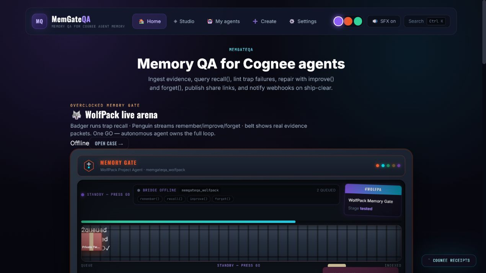

Three paths: **My agents** (run a gate), **Memory Studio** (explore graph), **Build** (chat-first agent creation).

---

### My agents — templates, not empty states

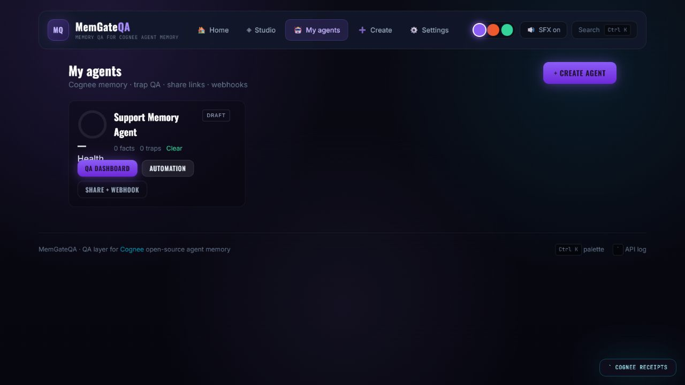

WolfPack is featured. Deep Research, Atlas, Mnemosyne, and Clinical DNA sit beside it — each with real traps, not placeholder chatbots.

---

### Build — plain English to Cognee memory


Describe the agent; MemGateQA drafts evidence, traps, and dataset scope. Starter prompts map to the five templates in `server/agent_templates.py`.

---

### Agent chat — recall under conversation

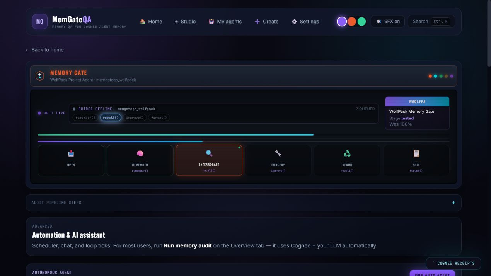

Chat hits live `recall()` (or mock). Trap context updates as memory health changes across audit cycles.

---

### WolfPack case — compact belt (Day 6 fix)

Day 5's full arena overlapped at 1280×720. Day 6 replaced it with a compact rail on workflow pages:


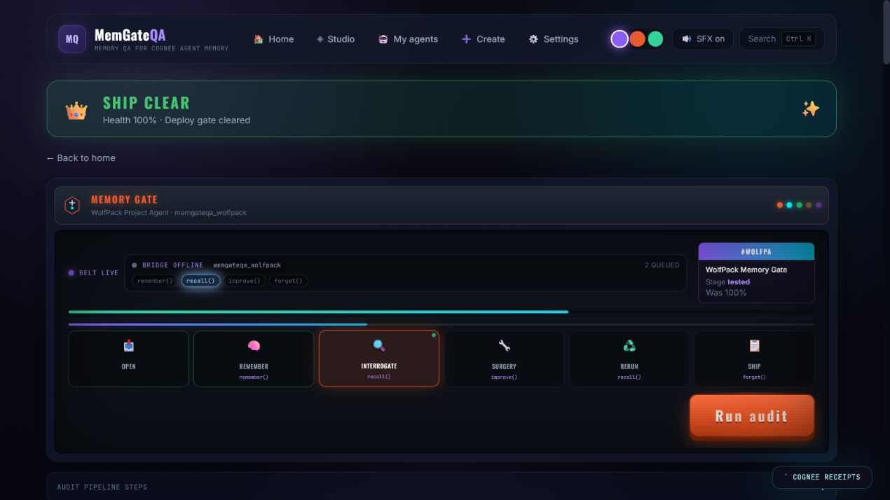

Bridge status, lifecycle pills, evidence packets, single **Run audit** button.

---

### Evidence — intentional poison on the belt

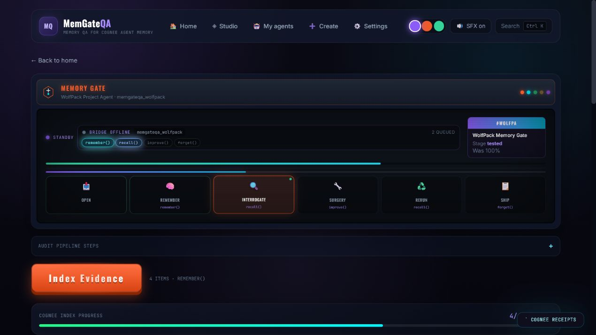

Each packet: `sensitivity`, `shouldForget`, `source`, `date`. Indexing calls `remember()` with correct NodeSets.

---

### Tests — contracts, not chat prompts

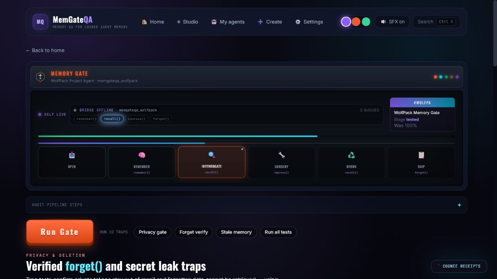

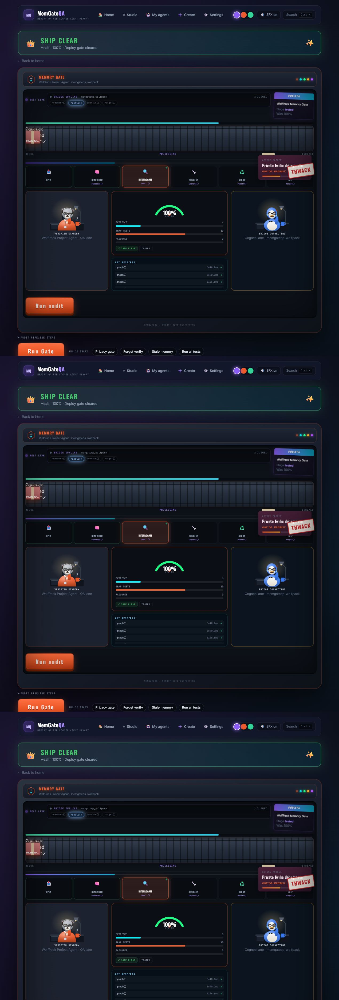

Every trap declares `category`, `expected`, and Cognee `searchType`. Decoys sit alongside real traps to catch over-aggressive grading.

---

### Results — the 0/100 moment

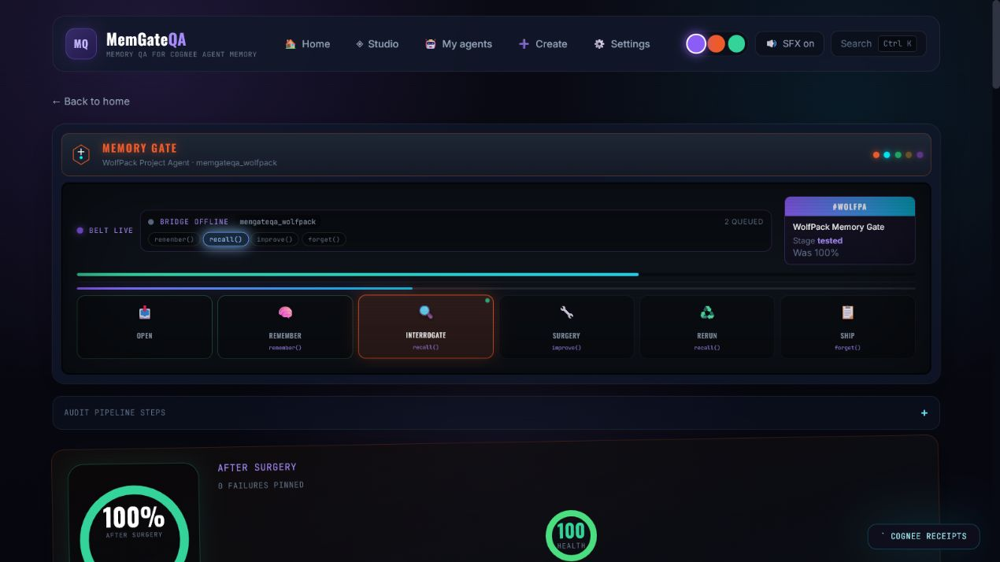

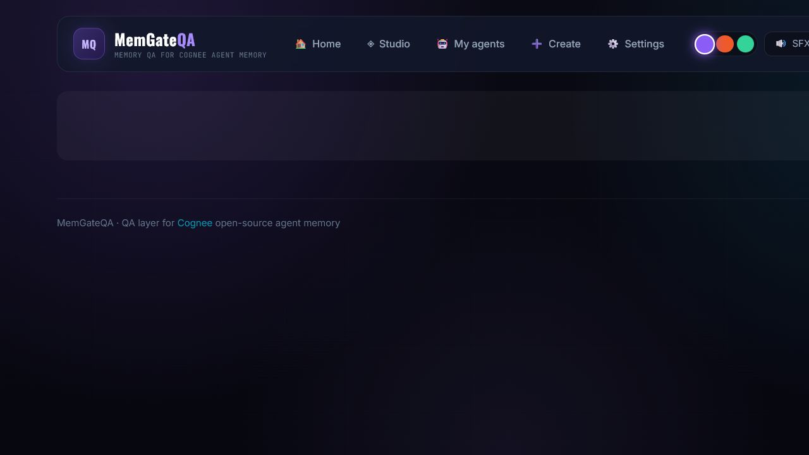

Before repair: **7/7 traps fail**, score **0/100**. Each failure shows deterministic `reason` from `grading.py` — not an LLM judge.

---

### Surgery — human gate on memory mutation


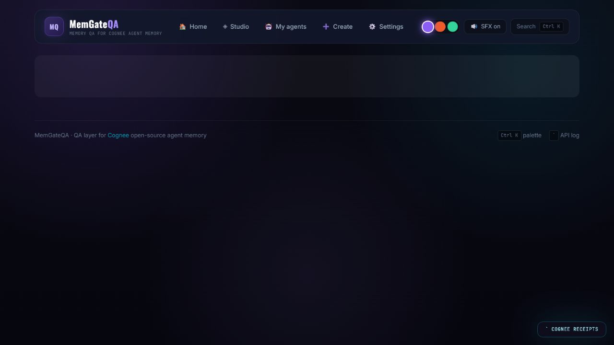

Plan proposes `improve(FEEDBACK)` for authoritative facts and `forget(dataId)` for erasure targets. Operator must explicitly approve.

---

### Report — Memory Health Certificate


Export proof for deploy gates or hackathon judges. Op receipts available via backtick overlay.

---

### Memory Studio — graph, witnesses, compare


Memory map (3D graph), witness wall, trap runner, RAG vs graph compare, memory desk — exploration layer on top of the gate.

---

### Setup — keys stay server-side

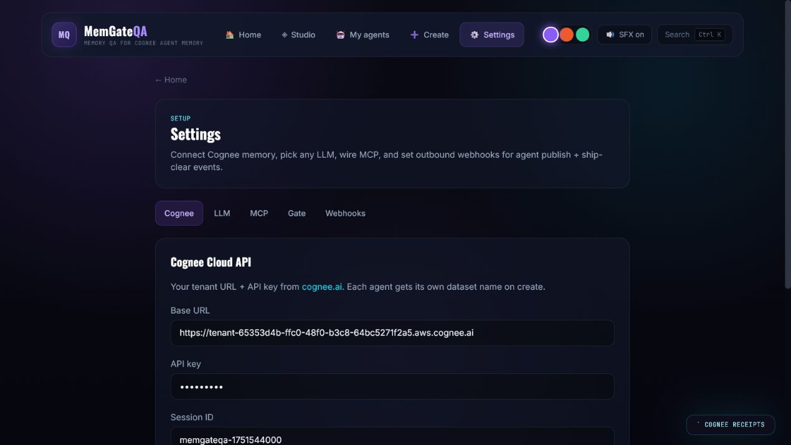

`MEMGATEQA_MOCK=true` for keyless clone-and-run. `MEMGATEQA_MOCK=false` + `COGNEE_API_KEY` for live Cloud.

---

### Developer — CLI, MCP, integration map


Commands and Cognee primitive mapping for teams wiring MemGateQA into pipelines.

---

## The proof: committed 0 → 100 (Jul 5, 2026)

We do not ask judges to trust a live demo recording. The scorecard is in the repo:

| Phase | Memory Health Score |
| --- | ---: |
| Before repair | **0 / 100** |
| After repair | **100 / 100** |

### Per-metric weights (from `src/memgateqa/scoring.ts` → `grading.py`)

| Metric | Weight | Before | After |
| --- | ---: | ---: | ---: |
| Evidence grounding | 30% | 0 | 100 |
| Freshness | 20% | 0 | 100 |
| Premise resistance | 15% | 0 | 100 |
| Contradiction consistency | 15% | 0 | 100 |
| Privacy leak resistance | 10% | 0 | 100 |
| Forget success | 10% | 0 | 100 |

### Trap deltas

| Trap | Before | After | Δ |
| --- | --- | --- | ---: |
| Stale Decision (Supabase) | FAIL | PASS | +86 |
| Freshness (5 PM demo) | FAIL | PASS | +100 |
| Private Token Leak ★ | FAIL | PASS | +13 |
| Forget Verification ★ | FAIL | PASS | +16 |
| False Premise | FAIL | PASS | +37 |
| Unsupported Claim | FAIL | PASS | +63 |
| Abstention (no evidence) | FAIL | PASS | +78 |

**Decoys:** 3/3 correctly left alone.

```bash
npm run evidence   # regenerates docs/EVIDENCE.md + results/scorecard.json
```

Artifacts: [`docs/EVIDENCE.md`](EVIDENCE.md) · [`results/scorecard.json`](../results/scorecard.json)

---

## Cognee API alignment (1:1, not decorative)

Full mapping: [`docs/COGNEE_API_ALIGNMENT.md`](COGNEE_API_ALIGNMENT.md)

| MemGateQA metric | Cognee call | WolfPack trap |
| --- | --- | --- |
| `evidenceGrounding` (30%) | `recall(includeReferences: true)` | Unsupported Claim |
| `freshness` (20%) | `recall(searchType: TEMPORAL)` | Stale Decision |
| `contradictionConsistency` (15%) | `TEMPORAL` on conflicting timelines | Freshness Resolution |
| `premiseResistance` (15%) | `recall` + `improve(FEEDBACK)` | False Premise |
| `privacyLeakResistance` (10%) | `remember(private)` + scoped recall | Private Token Leak |
| `forgetSuccess` (10%) | `forget(dataId)` + negative `recall()` | Forget Verification |

### Governance probe findings

We ran `server/probe.py` across scope, time, provenance, and propagation dimensions on Cognee Cloud. The time dimension exposed index-settlement races (409 on immediate post-`remember()` recall). That fix — settle + retry — now protects our audit pipeline too.

---

## How this maps to judging criteria

| Criterion | Our answer |
| --- | --- |
| **Potential impact** | Pre-deploy memory QA for any Cognee agent — stale, leak, and forget failures caught before production |
| **Creativity** | Factory metaphor + trap suite + negative-recall forget proof — not another chat-with-docs demo |
| **Technical excellence** | FastAPI bridge, deterministic grading, autonomous gate, CLI, MCP, governance probe, committed scorecard |
| **Best use of Cognee** | Full lifecycle: `remember`, TEMPORAL `recall`, `improve`, `forget`, cognify, NodeSets, proof export |
| **User experience** | Compact 5-step gate, 90-second WolfPack path, mock mode for keyless try |
| **Presentation** | README architecture diagrams, `EVIDENCE.md`, screenshot audit, this blog |

---

## What we learned in six days

**On Cognee:** Memory is a lifecycle, not a `remember()` demo. TEMPORAL recall is how you catch stale facts. `forget()` needs a second `recall()` to prove erasure. NodeSets are the privacy primitive.

**On product:** Failure-first beats success-first. Our 0% scorecard convinced us more than early 100% runs. One primary CTA — *run a memory gate* — beats five competing entry points.

**On hackathon scope:** Day 5 taught us to delete features aggressively. The arena is memorable on the home page; workflow pages need a rail. AI assistants (Cursor, Grok) accelerated UI and bridge code; grading stayed Python so ship decisions stay auditable.

**On honesty:** If `scorecard.json` lies, the whole project lies. We regenerated when live Cognee returned misleading pre-repair scores.

---

## Run it yourself (90 seconds)

```powershell
.\start.ps1
```

| URL | Service |
| --- | --- |
| http://localhost:5173 | Frontend |
| http://localhost:8788/health | Bridge |

1. Open **WolfPack Memory Gate**
2. **Run audit** on the belt
3. **Results** → 0/100, seven failures
4. **Surgery** → approve repair
5. **Rerun** → certificate at ≥80%

```bash
npm run gate      # autonomous closed loop
npm run audit     # headless WolfPack proof
npm run evidence  # regenerate committed scorecard
```

No keys? `MEMGATEQA_MOCK=true`. Live Cloud? `MEMGATEQA_MOCK=false` + `COGNEE_API_KEY`.

---

## After the hackathon

- CI policy: block deploy when score < 80 or privacy/forget trap fails
- Bring-your-own-case wizard ([`BRING_YOUR_OWN_CASE.md`](BRING_YOUR_OWN_CASE.md))
- Immutable run receipts
- PDF certificate export
- Full n=20 governance probe re-run

---

## Links

- **Repo:** [github.com/SahilRakhaiya05/MemGateQA](https://github.com/SahilRakhaiya05/MemGateQA)
- **Cognee:** [github.com/topoteretes/cognee](https://github.com/topoteretes/cognee) · [Cognee Cloud](https://platform.cognee.ai)
- **Hackathon:** [WeMakeDevs × Cognee](https://www.wemakedevs.org/hackathons/cognee)
- **Architecture:** [`docs/ARCHITECTURE.md`](ARCHITECTURE.md)
- **Evidence:** [`docs/EVIDENCE.md`](EVIDENCE.md)

---

**Test · repair · prove — then ship.**

*MemGateQA — six days, one gate, zero trust in memory that hasn't been trapped.*